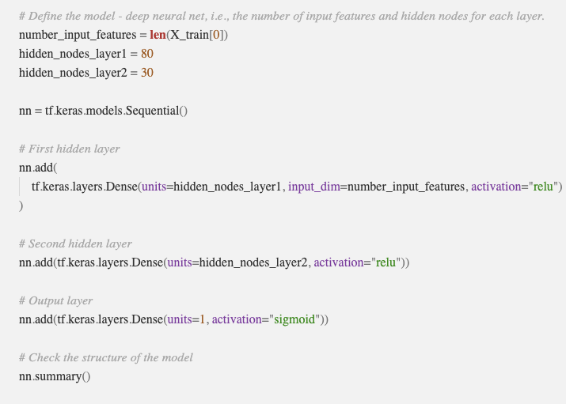
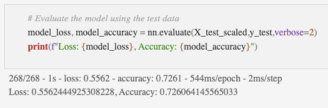
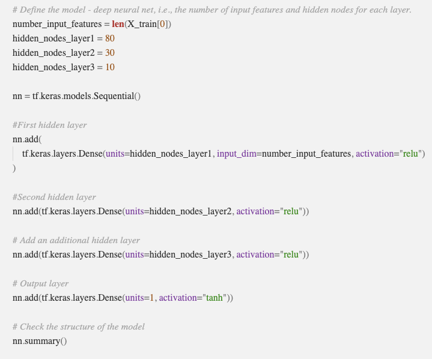
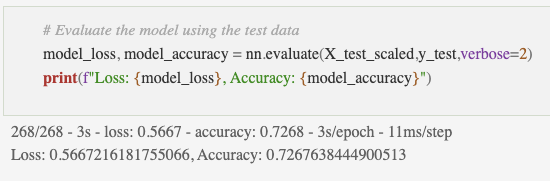

# Neural Network Charity Analysis

[Original Model](https://github.com/c-geisel/Neural_Network_Charity_Analysis/blob/main/AlphabetSoupCharity.ipynb)

[Model Optimization Trial](https://github.com/c-geisel/Neural_Network_Charity_Analysis/blob/main/AlphabetSoupCharity_Optimization.ipynb)

## Overview of the analysis: 
Alphabet Soup is a philanthropic organization that has donated 10 billion dollars to different organizations in the past 20 years. The goal of this organization is work to improve the world and they do this through their donations. Some of the donations made have not always led to success of a company. This analysis is thus completed in order to analyze past data on donations made and make a model that will predict if a donation will be successful based on a variety of factors. 

## Results: 
### Data Preprocessing
The target variable of this model is the "IS_SUCCESSFUL" column with a 1 referring to the donation being successful and a 0 referring to that organizations donation not being successful. With this being said, almost other columns beside this one are the features of our model. However, there are two columns that are not feature columns or target variables, and those are the "EIN" and "NAME" columns. These both are just identifiers for an organizationa dn have no impact on the successfulness of the outcome and are dropped from the dataframe. 

### Compiling, Training, and Evaluating the Model
Two models are made to decide on the successfullness of a donation. Initially, two hidden layers are used, the first with 80 neurons, and the second with 30 neurons. So many neurons are used because of the fact that there are 43 input features. This gives plently of opprtunities for the model to identify the correct weights to use. Along with these layers, the ReLU function is used in the hidden layers. ReLU is used as the data is positive, but also nonlinear. The output layer uses a sigmoid function since a binary classification result is desired. 

The first model with these specifications has a 72.6% accuracy which does not acheive the target performance of 75%. 

In order to try and increase the model performance, 3 changes were made. To being, the "STATUS" column is dropped. When a value counts method is performed on this column it shows 34,294 counts are an active status, and only 5 have a non-active status. Becuase of the majority of the column being a similar value is does not have much effect on the effectiveness of a result and thus it is remove. Another change that is made is changing the "sigmoid" function in the output layer to be a "tanh" function. This is used as it expands the possible output range. Finally, a third output layer is used as it assists the model in identifying nonlinear characteristics of input data without requireing more input data.

With these changes made, the model had an accuracy of 72.68% which raises the accuracy only by 8 ten-thousandths but still does not raise the accuracy to 75%. However, this new optimized model does display less signs of overfitting. 

## Summary: 
Summarize the overall results of the deep learning model. 
Include a recommendation for how a different model could solve this classification problem, and explain your recommendation.
